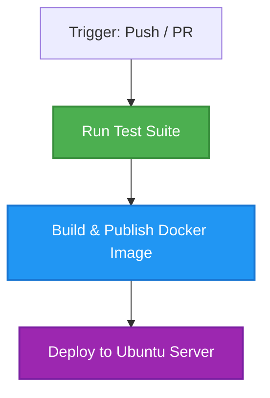

# Reha Astrology

`Doesn't work in browser environments. Please run on server`

```shell
npm i -S astroreha
```

1. Default House System: `Whole Sign`
2. Default Ayanamsha Used: `Lahiri`
3. Compatibility can have maximum 30 points. Default threshold for matching is 12. (>=12)

### Get Birth Chart

```javascript
const astroreha = require("astroreha");

// Get Birth Chart Details
/**
 * @param {String} dateString format YYYY-MM-DD
 * @param {String} timeString format HH:MM:SS
 * @param {Number} lat latitude
 * @param {Number} lng longitude
 * @param {Number} timezone timezone in hours
 */
const birthChart = astroreha.positioner.getBirthChart(
  "1989-06-10",
  "03:03:00",
  11.664325,
  78.146011,
  5.5,
);
// Get Rashi
birthChart.meta.Mo.rashi; // Rashi is Moon Sign in Indian Astrology
// Get Sun Sign
birthChart.meta.Su.rashi;
// Get Grahas in a certain Rashi
birthChart.aries.signs; // returns an array of grahas

// Get compatibility (returns Boolean)
astroreha.compatibility.areCompatible(
  { dateString, timeString, lat, lng, timezone },
  { dateString, timeString, lat, lng, timezone },
);
```

## Updates for 1.1.5

1. Changed Getting Navamsa Chart Logic to be more accurate considering floating point inaccuracies
2. More constants available

## Breaking Changes

1. Not a default Export anymore
2. Gives Positioner and Compatibility Feature

### Verified with [Prokerela.com](https://www.prokerala.com)

## AstroReha API Server (`port 1300`)

### Swagger Documentation
The interactive API documentation is available at:
* **Local:** [http://localhost:1300/api-docs](http://localhost:1300/api-docs)
* **Ubuntu Server / Remote:** `http://<your-server-ip>:1300/api-docs`

---

### Scripts Helper
We provide pre-configured scripts to easily manage the service:
* **Docker Clean Start:** `./docker_start.sh` (Linux/Ubuntu) or `docker_start.bat` (Windows)
* **Docker Stop:** `./docker_stop.sh` (Linux/Ubuntu) or `docker_stop.bat` (Windows)
* **Setup Project:** `./setup.sh` (Linux/Ubuntu) or `setup.bat` (Windows)
* **Local Native Start:** `./start_server.sh` (Linux/Ubuntu) or `start_server.bat` (Windows)
* **Local Native Stop:** `./stop_server.sh` (Linux/Ubuntu) or `stop_server.bat` (Windows)

Make scripts executable on Linux/Ubuntu:
```shell
chmod +x setup.sh docker_start.sh docker_stop.sh start_server.sh stop_server.sh
```

---

### Docker Compose Commands Reference

#### 1. Start Commands
* **Start in background (Detached mode - Recommended):**
  ```shell
  docker-compose up -d
  ```
* **Start and force a rebuild:**
  ```shell
  docker-compose up -d --build
  ```
* **Start in foreground (View logs live):**
  ```shell
  docker-compose up
  ```

#### 2. Stop Commands
* **Stop and remove containers (Recommended):**
  ```shell
  docker-compose down
  ```
* **Stop containers without removing them:**
  ```shell
  docker-compose stop
  ```

#### 3. Restart Commands
* **Quick Restart:**
  ```shell
  docker-compose restart
  ```
* **Clean Rebuild and Restart:**
  ```shell
  docker-compose down && docker-compose up -d --build
  ```

---

## CI/CD Deployment Pipeline

This repository includes a fully automated **GitHub Actions CI/CD Pipeline** (`.github/workflows/ci-cd.yml`) to verify, containerize, and deploy the AstroReha API service.

### Pipeline Workflows & Triggers
The pipeline is triggered automatically on:
* **Pushes** to: `main`, `master`, `dev`, and `develop`
* **Pull Requests** targeting: `main` and `master`

### Jobs Structure



#### 1. Run Test Suite
* **Environment:** `ubuntu-latest` running Node.js v24.
* **Tasks:** Installs dependencies and executes smoke verification tests (`npm test`).

#### 2. Build & Publish Docker Image (GHCR)
* **Environment:** `ubuntu-latest` with QEMU and Docker Buildx.
* **Tasks:**
  * Builds a production-ready multi-platform Docker container.
  * On pushes to release branches (`main`/`master`), logs into **GitHub Container Registry (GHCR)** and publishes the image:
    * `ghcr.io/themgr/astroreha_port_1300:latest`
    * `ghcr.io/themgr/astroreha_port_1300:<commit-sha>`

#### 3. Continuous Deployment (CD)
* **Environment:** `ubuntu-latest`
* **Condition:** Successful builds on pushes to `main` or `master`.
* **Tasks:**
  * Installs Cloudflare Tunnel agent (`cloudflared`).
  * Establishes a secure SSH connection to the remote Ubuntu server (`ssh.mahendhraa.com`) routed securely via Cloudflare Tunnel.
  * Injects SSH credentials using GitHub Secret `DELL_E5420_CICD_KEY`.
  * Logs into the server, navigates to the project directory `/home/manivannang/projects/astroreha_port_1300`, pulls the latest code, and triggers a clean container rebuild via `./docker_start.sh`.

### Required GitHub Repository Secrets

To ensure the CD deployment functions properly, the following secrets must be configured in your GitHub Repository under **Settings** ➔ **Secrets and variables** ➔ **Actions**:

| Secret Name | Description |
| :--- | :--- |
| `DELL_E5420_CICD_KEY` | The private SSH key authorized to connect to your Ubuntu server. |


